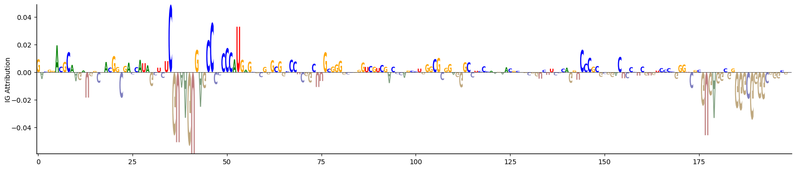

# convolutional neural network for deciphering sequence features discriminating two groups of sequences

## Description
Given two groups of biological sequences that are subject to different regulatory regimes, what sets them apart? One possibility is the underlying DNA sequence.
Here I use TensorFlow to create a 2D convolutional NN model using a set of sequences from each of the two classes. 
Grid search to find optimal hyperparameters. 
Lastly, the Integrated gradients method is used to extract feature importances (here, the importance of individual sequence positions).

## Misc

* Based on [DeepRiPe](https://github.com/ohlerlab/DeepRiPe) 
* Some functions taken from [Neural Network DNA demo](https://github.com/const-ae/Neural_Network_DNA_Demo)
* Feature importances estimated using [Integrated Gradients method](https://arxiv.org/abs/1703.01365)

## Output - IG attribution of positions in one sequence

